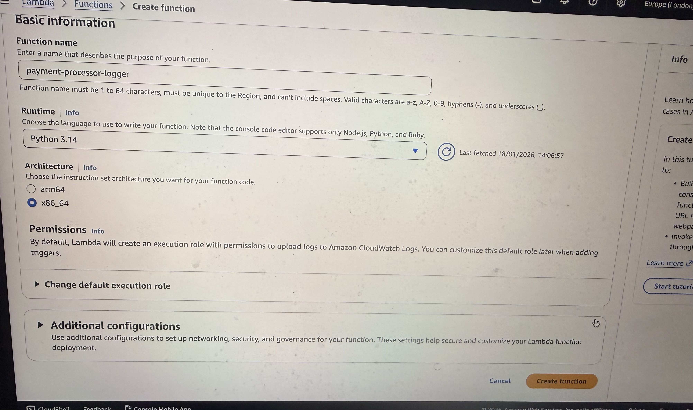
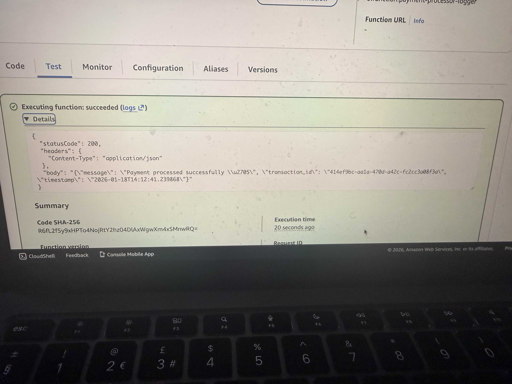
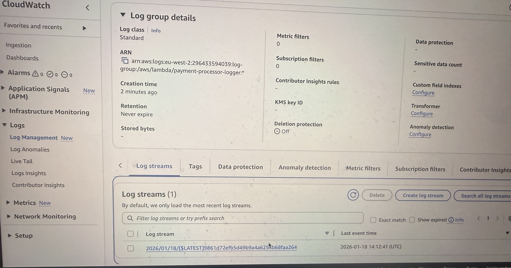
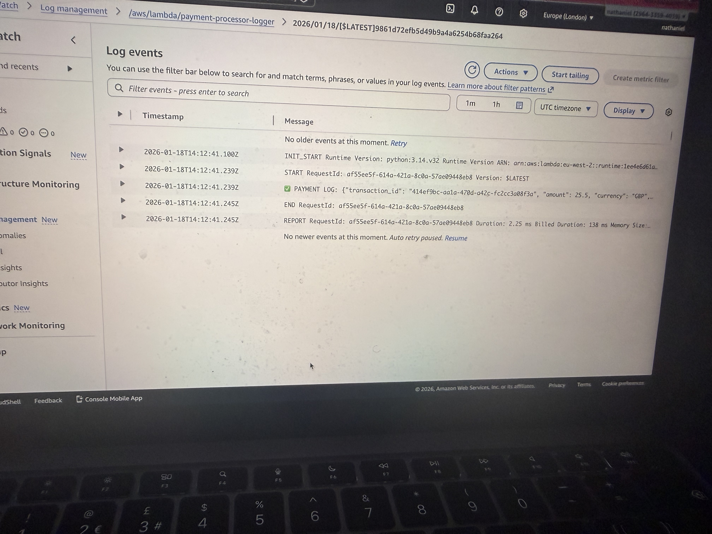

# Payment Processor Logger (AWS Lambda + CloudWatch)

A lightweight serverless payment logging service built with AWS Lambda.  
It simulates payment processing, generates a transaction ID, and writes an audit log entry to CloudWatch Logs.

---

## ✅ What this project does
- Receives a payment request (simulated event input)
- Generates a unique transaction ID
- Logs the payment event for audit + traceability
- Returns a structured success response

---

## 🧱 Architecture (High-Level)

**Client/Test Event → AWS Lambda → CloudWatch Logs**

> This mirrors how fintech systems handle **audit trails**, debugging, and traceability.

---

## 📸 Screenshots (Evidence)

### 1) Lambda Function Test Result (Success Response)

### 2) CloudWatch Log Group Created Automatically

### 3) CloudWatch Log Stream Showing Transaction Event

### 4) Lambda Execution Log Output (Audit Evidence)

---

## 🐞 Debugging & Lessons Learned (Real-World Troubleshooting)

### Issue 1: DynamoDB Validation Errors
During development I attempted to store transactions in DynamoDB, but faced repeated errors due to missing partition key values and table configuration mismatches.

✅ **Fix/Alternative:** I switched to CloudWatch Logs to capture payment audit logs reliably while keeping the system lightweight.

### Issue 2: Faster Logging & Reduced Complexity
CloudWatch logging removed the need for:
- DynamoDB table setup
- region mismatch issues
- IAM permission complexity
- schema constraints

✅ Result: a working, clean audit trail system.

---

## 💼 Why this matters for businesses
This approach supports:
- **Audit logging**
- **Transaction traceability**
- **Operational monitoring**
- **Compliance-style logging** (useful in fintech + regulated environments)

---

## 🛠️ Tech Stack
- AWS Lambda (Python)
- Amazon CloudWatch Logs

---

## ✅ Next Improvements (Planned)
- Add API Gateway endpoint (REST)
- Add structured JSON logging
- Add error handling + retries
- Add metrics/alerts for failed transactions
